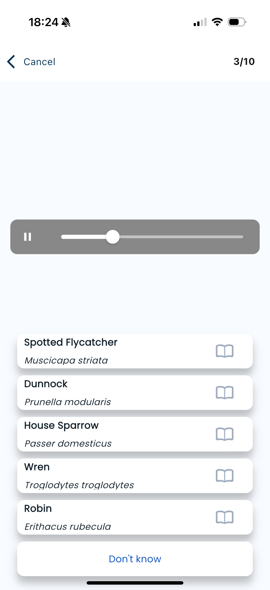
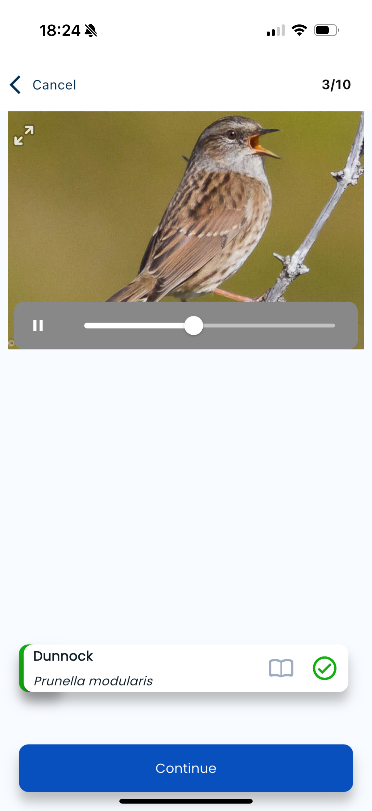
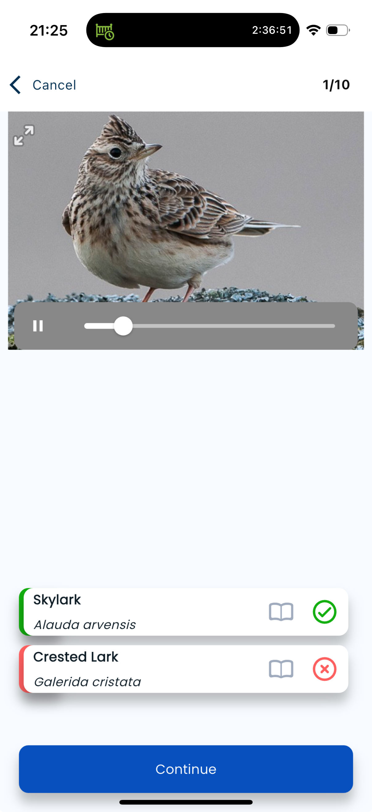

# Quiz Mode Implementatie Plan

*Onderzoeksplan - januari 2026*

Dit document beschrijft het implementatieplan voor een BirdID-style quiz mode met multiple choice antwoorden.

---

## 1. Concept Overzicht

### Wat is Quiz Mode?

Een leermodus waarbij de gebruiker een foto/geluid ziet en moet kiezen uit meerdere soorten. In tegenstelling tot de huidige flashcard-modus (self-rating) is dit **objectieve verificatie**: het systeem bepaalt of het antwoord goed of fout is.

### Referentie: BirdID.no

Uit de [UX research documentatie](./ux-research-flashcard-apps.md#4-birdidno---gespecialiseerd-voor-soortherkenning):

| Feature | BirdID | Naturae Quiz Mode |
|---------|--------|-------------------|
| Vraagformaat | Foto/audio → kies uit opties | Foto/audio → kies uit opties |
| Aantal opties | 4-6 soorten | Instelbaar: 3, 4, of 6 |
| Timer | 30 seconden | Optioneel (later) |
| Scoring | +1 correct, -1 fout, 0 skip | +1 correct, 0 fout (MVP) |
| "Weet niet" optie | Ja | Ja |

---

## 2. Kernvraag: Hoe Genereer je Distractor Opties?

De belangrijkste technische uitdaging is het genereren van **plausibele foute antwoorden** (distractors). Deze moeten:

1. **Taxonomisch gerelateerd zijn** (dezelfde familie/orde)
2. **Vergelijkbaar genoeg zijn** om de quiz uitdagend te maken
3. **Niet het correcte antwoord zijn**

### Strategie: Hybride Aanpak (Taxonomisch + Fallback)

**Goed nieuws:** De codebase heeft al volledige GBIF taxonomie-integratie! Dit maakt taxonomische distractors **direct mogelijk in de MVP**.

#### Bestaande Infrastructure

De volgende data is al beschikbaar:

1. **`species.taxonomy`** bevat: `kingdom`, `phylum`, `class`, `order`, `family`, `genus`
2. **`GBIFSuggestResult`** bevat ook: `familyKey`, `orderKey`, `genusKey` etc.
3. **GBIF Species Search API** ondersteunt: `/species/search?family=Paridae&rank=SPECIES`

#### Distractor Generatie Algoritme

```
┌─────────────────────────────────────────────────────────────────┐
│  DISTRACTOR SELECTIE (prioriteit volgorde)                      │
├─────────────────────────────────────────────────────────────────┤
│                                                                 │
│  1. ZELFDE FAMILIE (uit leerset)                                │
│     → Koolmees vraag: Pimpelmees, Kuifmees, Zwarte mees         │
│     → Beste optie: taxonomisch vergelijkbaar + relevant         │
│                                                                 │
│  2. ZELFDE FAMILIE (via GBIF API) - als leerset te klein        │
│     → Haal andere Paridae soorten op via family parameter       │
│     → Fallback als <3 soorten in leerset uit dezelfde familie   │
│                                                                 │
│  3. ZELFDE ORDE (uit leerset)                                   │
│     → Als geen familie-matches: zelfde orde (bijv. Passeriformes)│
│                                                                 │
│  4. RANDOM UIT LEERSET                                          │
│     → Laatste fallback voor generieke leersets                  │
│                                                                 │
└─────────────────────────────────────────────────────────────────┘
```

#### Implementatie

```typescript
interface DistractorOptions {
  correctCard: CardWithSpecies;
  allCards: CardWithSpecies[];
  count: number; // 3, 4, of 5 distractors
  useTaxonomy?: boolean; // default: true
}

async function getDistractors(options: DistractorOptions): Promise<QuizOption[]> {
  const { correctCard, allCards, count, useTaxonomy = true } = options;
  const correctFamily = correctCard.species?.taxonomy?.family;
  const correctOrder = correctCard.species?.taxonomy?.order;

  // Pool van mogelijke distractors (excl. correct antwoord)
  const candidates = allCards.filter(c => c.id !== correctCard.id);

  if (!useTaxonomy || !correctFamily) {
    // Fallback: random uit leerset
    return shuffleArray(candidates).slice(0, count).map(cardToOption);
  }

  // 1. Zoek soorten uit dezelfde FAMILIE in de leerset
  const sameFamily = candidates.filter(
    c => c.species?.taxonomy?.family === correctFamily
  );

  if (sameFamily.length >= count) {
    return shuffleArray(sameFamily).slice(0, count).map(cardToOption);
  }

  // 2. Niet genoeg in leerset? → Haal via GBIF API
  const needed = count - sameFamily.length;
  const gbifDistractors = await fetchGBIFRelatedSpecies(
    correctCard.species.gbif_key,
    correctFamily,
    needed
  );

  // 3. Combineer leerset + GBIF distractors
  const combined = [...sameFamily.map(cardToOption), ...gbifDistractors];

  if (combined.length >= count) {
    return shuffleArray(combined).slice(0, count);
  }

  // 4. Nog niet genoeg? → Vul aan met zelfde ORDE
  const sameOrder = candidates.filter(
    c => c.species?.taxonomy?.order === correctOrder &&
         c.species?.taxonomy?.family !== correctFamily
  );

  return shuffleArray([...combined, ...sameOrder.map(cardToOption)]).slice(0, count);
}

/**
 * Haal gerelateerde soorten op via GBIF (zelfde familie)
 */
async function fetchGBIFRelatedSpecies(
  excludeKey: number,
  family: string,
  limit: number
): Promise<QuizOption[]> {
  // GBIF Species Search API ondersteunt family parameter
  const url = `${GBIF_API_BASE}/species/search?family=${encodeURIComponent(family)}&rank=SPECIES&status=ACCEPTED&limit=${limit * 2}`;

  const response = await fetch(url, { next: { revalidate: 3600 } }); // Cache 1 uur
  const data = await response.json();

  // Haal voor elke soort ook de Nederlandse naam op (parallel)
  const species = data.results
    .filter((s: GBIFSuggestResult) => s.key !== excludeKey && s.nubKey)
    .slice(0, limit);

  // Ophalen van vernacular names voor Nederlandse namen
  const withNames = await Promise.all(
    species.map(async (s: GBIFSuggestResult) => {
      const names = await fetchGBIFVernacularNames(s.nubKey || s.key);
      const dutchName = names.find(n => n.language === "nld" || n.language === "nl");
      return {
        id: `gbif-${s.key}`,
        label: dutchName?.vernacularName || s.canonicalName,
        scientificName: s.scientificName,
        isFromGBIF: true,
      };
    })
  );

  return withNames;
}
```

#### Voorbeeld Quiz Generatie

**Leerset: "Nederlandse Tuinvogels" (20 kaarten)**

| Vraag | Familie | Distractors uit leerset | GBIF fallback nodig? |
|-------|---------|------------------------|---------------------|
| Koolmees | Paridae | Pimpelmees, Kuifmees, Staartmees | Nee |
| Merel | Turdidae | Zanglijster, Roodborst | Nee |
| Grote bonte specht | Picidae | (alleen 1 specht in set) | Ja → Middelste/Kleine bonte specht |

**Leerset: "Europese Vlinders" (8 kaarten)**

| Vraag | Familie | Distractors uit leerset | GBIF fallback nodig? |
|-------|---------|------------------------|---------------------|
| Dagpauwoog | Nymphalidae | Kleine vos, Atalanta | Nee |
| Citroenvlinder | Pieridae | Koolwitje | Ja → Oranjetipje, Resedawitje |

### Voordelen van Taxonomische Distractors

1. **Educatief waardevol** - Gebruiker leert onderscheid tussen verwante soorten
2. **Realistisch uitdagend** - Zoals in het veld: "Is dit een Koolmees of Pimpelmees?"
3. **Werkt met elke leerset-grootte** - GBIF fallback voor kleine sets
4. **Geen vooraf gecureerde data nodig** - Dynamisch gegenereerd
5. **Schaalt automatisch** - Meer soorten in leerset = minder API calls

### Implementatie Complexiteit

| Component | Complexiteit | Reden |
|-----------|--------------|-------|
| Leerset distractors | Laag | Filter op `taxonomy.family` |
| GBIF API fallback | Medium | Extra API calls (maar cacheable) |
| Nederlandse namen | Medium | Extra API calls voor vernacular names |

### Caching Strategie

```typescript
// Cache GBIF family searches voor 1 uur
const familyCache = new Map<string, QuizOption[]>();

async function getCachedFamilyMembers(family: string): Promise<QuizOption[]> {
  if (familyCache.has(family)) {
    return familyCache.get(family)!;
  }
  const members = await fetchGBIFRelatedSpecies(0, family, 20);
  familyCache.set(family, members);
  return members;
}
```

### Conclusie Distractors

**Taxonomische distractors zijn haalbaar in de MVP** dankzij:
1. Bestaande `species.taxonomy` data in de database
2. GBIF API `/species/search?family=X` endpoint
3. Fallback mechanisme voor edge cases

De implementatie is incrementeel:
- **Stap 1:** Filter op familie uit leerset (geen API calls)
- **Stap 2:** GBIF fallback als leerset te klein is
- **Stap 3:** Cache populaire families voor performance

---

## 3. BirdID UI Referentie Analyse

Gebaseerd op de screenshots in [docs/research/Reference/](./Reference/):

### Start Screen (BirdID-01)


**Elementen:**
- **Area selector** - Regio kiezen (Nederland, etc.)
- **Number of questions** - 10, 30, 60 opties
- **Time per question** - Unlimited of 30 sec
- **Level selector** - 1 t/m 4 (Beginner → Expert)

**Naturae MVP:** Start simpel met alleen aantal vragen + aantal opties.

### Question Interface (BirdID-02)



**Elementen:**
- Header: "Cancel" + voortgang (3/10)
- Media player (audio met progress bar)
- 5 antwoord opties met:
  - Nederlandse naam (bold)
  - Wetenschappelijke naam (italic)
  - Info icon (→ naar soort pagina)
- "Don't know" optie onderaan

### Correct Answer (BirdID-03)



**Feedback:**
- Foto van de soort verschijnt
- Alleen het correcte antwoord blijft zichtbaar
- Groene checkmark ✅
- "Continue" button

### Wrong Answer (BirdID-03-Wrong)



**Feedback:**
- Foto van de soort verschijnt
- Gekozen (foute) antwoord: rode rand + ❌
- Correcte antwoord: groene rand + ✅
- Beide blijven zichtbaar voor vergelijking

### Species Info (BirdID-04)


**Elementen:**
- Carrousel met foto's (met annotaties!)
- Soortnaam + wetenschappelijke naam
- Audio sample
- Beschrijving "Appearance"
- Navigatie naar volgende/vorige soort

**Naturae:** Later implementeren als "Leer meer" functie.

### UI Design Beslissingen voor Naturae

| Aspect | BirdID | Naturae MVP |
|--------|--------|-------------|
| Aantal opties | 5 + "Don't know" | 4 + "Weet niet" |
| Weergave na antwoord | Alle opties verdwijnen behalve correct (+ fout) | Zelfde aanpak |
| Foto na antwoord | Ja, groot | Ja (als beschikbaar) |
| Wetenschappelijke naam | Altijd zichtbaar | Optioneel (instelling) |
| Info knop | Ja, naar soort pagina | Later |

### BirdID "Bird Book" - Soortenpagina Analyse

Gebaseerd op screenshots BirdID-04-SpeciesExplanation 1-4:

#### Informatie op de Soortenpagina

| Sectie | Inhoud | Bron |
|--------|--------|------|
| **Header** | Foto carrousel met annotaties (pijlen naar kenmerken) | Eigen content |
| **Namen** | Nederlandse naam, wetenschappelijke naam, lokale naam (Noors) | Taxonomie database |
| **Audio** | Geluidsfragment met player | Xeno-canto |
| **Appearance** | Tekstuele beschrijving van uiterlijk | Eigen content |
| **Sound** | Tekstuele beschrijving van geluid | Eigen content |
| **Facts** | Wingspan, Length, Weight, Size Group | GBIF/Wikipedia |
| **Egg** | Foto van ei + link "See similar eggs" | Eigen content |
| **Distribution** | Link naar xeno-canto verspreidingskaart | Xeno-canto |
| **Ecology** | Link naar Birdlife ecology info | Externe bron |
| **Links** | Observation.org, Video IBC, Flickr, Xeno-canto, Featherbase | Externe bronnen |
| **Similar Species** | Foto's + geluidsiconen van verwante soorten | Taxonomie + media |

#### Haalbaarheid voor Naturae

| Sectie | Haalbaarheid | Bron voor Naturae |
|--------|--------------|-------------------|
| Foto carrousel | ✅ Direct | GBIF/iNaturalist media |
| Namen | ✅ Direct | Bestaande `species` tabel |
| Audio | ✅ Mogelijk | **Xeno-canto API** (zie sectie 13) |
| Appearance/Sound tekst | ⚠️ Handmatig | Wikipedia API of handmatig |
| Facts (wingspan etc.) | ⚠️ Beperkt | GBIF heeft dit niet standaard |
| Distribution map | ✅ Mogelijk | GBIF occurrence map of xeno-canto |
| Similar Species | ✅ Direct | Taxonomie (zelfde familie) |

---

## 3b. Integratie in Bestaande UI

### Waar Past Quiz Mode in de Huidige UX?

De huidige studeer-flow is:

```
Deck pagina → "Leren" knop → SessionModeSelector → Study sessie
```

### Nieuwe Structuur: Twee Hoofdmodi

De SessionModeSelector krijgt **twee hoofdmodi** op het hoogste niveau:

| Hoofdmodus | Beschrijving | Submodi |
|------------|--------------|---------|
| **Flashcards** | Klassieke kaarten met voor/achterkant | Volgorde, Shuffle, Slim leren, Openbare foto's |
| **Quiz** | Multiple choice vragen | (geen submodi in MVP) |

### UI Mockup: Vernieuwde SessionModeSelector

```
┌─────────────────────────────────────────────────┐
│         Kies een leermodus                      │
├─────────────────────────────────────────────────┤
│                                                 │
│  ┌───────────────────┐ ┌───────────────────┐    │
│  │                   │ │                   │    │
│  │   📚 Flashcards   │ │   🏆 Quiz         │    │
│  │                   │ │                   │    │
│  └───────────────────┘ └───────────────────┘    │
│        ▲ geselecteerd                           │
│                                                 │
│  ─────────────────────────────────────────────  │
│                                                 │
│  [Flashcard instellingen verschijnen hier]     │
│                                                 │
└─────────────────────────────────────────────────┘
```

### UI Mockup: Flashcards Geselecteerd

```
┌─────────────────────────────────────────────────┐
│         Kies een leermodus                      │
├─────────────────────────────────────────────────┤
│                                                 │
│  ╔═══════════════════╗ ┌───────────────────┐    │
│  ║   📚 Flashcards   ║ │   🏆 Quiz         │    │
│  ╚═══════════════════╝ └───────────────────┘    │
│                                                 │
│  ─────────────────────────────────────────────  │
│                                                 │
│  Kies een variant:                              │
│                                                 │
│  ┌─────────────────────────────────────────┐    │
│  │ 📋  Volgorde                     20 ▸   │    │
│  │     Alle kaarten in vaste volgorde      │    │
│  └─────────────────────────────────────────┘    │
│                                                 │
│  ┌─────────────────────────────────────────┐    │
│  │ 🔀  Shuffle                      20 ▸   │    │
│  │     Alle kaarten in willekeurige...     │    │
│  └─────────────────────────────────────────┘    │
│                                                 │
│  ┌─────────────────────────────────────────┐    │
│  │ 🧠  Slim leren                    8 ▸   │    │
│  │     Alleen kaarten die je moet...       │    │
│  └─────────────────────────────────────────┘    │
│                                                 │
│  ┌─────────────────────────────────────────┐    │
│  │ 🌿  Openbare foto's              18 ▸   │    │
│  │     Leer met gevarieerde natuur...      │    │
│  └─────────────────────────────────────────┘    │
│                                                 │
│  ─────────────────────────────────────────────  │
│                                                 │
│  Aantal kaarten: [10] [30] [60] [Alle]          │
│                                                 │
│              [Start sessie]                     │
│                                                 │
└─────────────────────────────────────────────────┘
```

### UI Mockup: Quiz Geselecteerd

```
┌─────────────────────────────────────────────────┐
│         Kies een leermodus                      │
├─────────────────────────────────────────────────┤
│                                                 │
│  ┌───────────────────┐ ╔═══════════════════╗    │
│  │   📚 Flashcards   │ ║   🏆 Quiz         ║    │
│  └───────────────────┘ ╚═══════════════════╝    │
│                                                 │
│  ─────────────────────────────────────────────  │
│                                                 │
│  Test je kennis met multiple choice vragen.     │
│  Krijg direct feedback en zie je score.         │
│                                                 │
│  Aantal vragen: [10] [20] [30] [Alle]           │
│                                                 │
│  Beschikbaar: 18 soorten                        │
│                                                 │
│              [Start quiz]                       │
│                                                 │
└─────────────────────────────────────────────────┘
```

> **Note:** De quiz gebruikt automatisch verwante soorten als antwoordopties
> (bijv. andere mezen bij een vraag over de Koolmees). Dit is geen instelling
> maar gewoon hoe de quiz werkt - de gebruiker hoeft dit niet te weten.

### Benodigde Backend Wijzigingen

De SessionModeSelector UI-wijziging is relatief eenvoudig, maar quiz mode vereist ook backend werk:

| Component | Type | Beschrijving |
|-----------|------|--------------|
| `getQuizCards` | Server Action | Haalt kaarten op + genereert distractors |
| `getRelatedSpecies` | Server Action | Zoekt verwante soorten via GBIF taxonomie |
| `QuizSession` | Component | Nieuwe session component (anders dan flashcard) |
| `QuizQuestion` | Component | Multiple choice vraag UI |
| URL routing | Config | `?mode=quiz` parameter afhandelen |

#### Nieuwe Server Action: getQuizCards

```typescript
// src/lib/actions/quiz.ts

interface QuizCard {
  cardId: string;
  speciesId: string;
  correctAnswer: {
    name: string;
    scientificName: string;
  };
  options: Array<{
    name: string;
    scientificName: string;
    isCorrect: boolean;
  }>;
  photo: {
    url: string;
    creator: string;
    license: string;
  };
}

export async function getQuizCards(
  deckId: string,
  options?: { limit?: number }
): Promise<{ data: QuizCard[]; error?: string }> {
  // 1. Haal kaarten met GBIF-koppeling op
  // 2. Voor elke kaart: genereer distractors uit zelfde familie
  // 3. Haal GBIF foto's op
  // 4. Return quiz-ready data
}
```

### Technische Implementatie

```tsx
// session-mode-selector.tsx - Nieuwe structuur

type MainMode = "flashcards" | "quiz";
type FlashcardVariant = "order" | "shuffle" | "smart" | "photos";

interface SessionModeSelectorState {
  mainMode: MainMode;
  flashcardVariant: FlashcardVariant | null;
  cardLimit: number | null;
}

// De URL structuur blijft backwards-compatible:
// /study/[deckId]?mode=order      → Flashcards, volgorde
// /study/[deckId]?mode=shuffle    → Flashcards, shuffle
// /study/[deckId]?mode=smart      → Flashcards, slim leren
// /study/[deckId]?mode=photos     → Flashcards, openbare foto's
// /study/[deckId]?mode=quiz       → Quiz mode (NIEUW)
```

### Quiz Session UI

```
┌─────────────────────────────────────────────────┐
│  ← Stoppen    Nederlandse Vogels        3/10   │
│               Quiz                              │
│  ▓▓▓▓▓▓▓▓▓▓░░░░░░░░░░░░░░░░░░░░  Score: 2     │
├─────────────────────────────────────────────────┤
│                                                 │
│        ┌───────────────────────────┐            │
│        │                           │            │
│        │     [Foto van vogel]      │            │
│        │                           │            │
│        │  📷 J. Smith · CC-BY      │            │
│        └───────────────────────────┘            │
│                                                 │
│  ┌─────────────────────────────────────────┐    │
│  │  Koolmees                           📖  │    │
│  │  Parus major                            │    │
│  └─────────────────────────────────────────┘    │
│                                                 │
│  ┌─────────────────────────────────────────┐    │
│  │  Pimpelmees                         📖  │    │
│  │  Cyanistes caeruleus                    │    │
│  └─────────────────────────────────────────┘    │
│                                                 │
│  ┌─────────────────────────────────────────┐    │
│  │  Kuifmees                           📖  │    │
│  │  Lophophanes cristatus                  │    │
│  └─────────────────────────────────────────┘    │
│                                                 │
│  ┌─────────────────────────────────────────┐    │
│  │  Zwarte mees                        📖  │    │
│  │  Periparus ater                         │    │
│  └─────────────────────────────────────────┘    │
│                                                 │
│  ┌ ─ ─ ─ ─ ─ ─ ─ ─ ─ ─ ─ ─ ─ ─ ─ ─ ─ ─ ─ ┐    │
│    Weet ik niet                                 │
│  └ ─ ─ ─ ─ ─ ─ ─ ─ ─ ─ ─ ─ ─ ─ ─ ─ ─ ─ ─ ┘    │
│                                                 │
│        Sneltoetsen: 1-4 voor keuze             │
│                                                 │
└─────────────────────────────────────────────────┘
```

### Na Beantwoorden (Correct)

```
┌─────────────────────────────────────────────────┐
│  ← Stoppen    Nederlandse Vogels        3/10   │
│               Quiz                              │
│  ▓▓▓▓▓▓▓▓▓▓░░░░░░░░░░░░░░░░░░░░  Score: 3     │
├─────────────────────────────────────────────────┤
│                                                 │
│        ┌───────────────────────────┐            │
│        │                           │            │
│        │     [Foto van vogel]      │            │
│        │                           │            │
│        └───────────────────────────┘            │
│                                                 │
│  ╔═══════════════════════════════════════════╗  │
│  ║  ✅ Koolmees                          📖  ║  │  ← Groen
│  ║     Parus major                           ║  │
│  ╚═══════════════════════════════════════════╝  │
│                                                 │
│                                                 │
│                                                 │
│              [Volgende vraag →]                 │
│                                                 │
│                                                 │
│        Sneltoets: Spatie of Enter              │
│                                                 │
└─────────────────────────────────────────────────┘
```

### Na Beantwoorden (Fout)

```
┌─────────────────────────────────────────────────┐
│  ← Stoppen    Nederlandse Vogels        3/10   │
│               Quiz                              │
│  ▓▓▓▓▓▓▓▓▓▓░░░░░░░░░░░░░░░░░░░░  Score: 2     │
├─────────────────────────────────────────────────┤
│                                                 │
│        ┌───────────────────────────┐            │
│        │                           │            │
│        │     [Foto van vogel]      │            │
│        │                           │            │
│        └───────────────────────────┘            │
│                                                 │
│  ╔═══════════════════════════════════════════╗  │
│  ║  ✅ Koolmees                          📖  ║  │  ← Groen (correct)
│  ║     Parus major                           ║  │
│  ╚═══════════════════════════════════════════╝  │
│                                                 │
│  ┌───────────────────────────────────────────┐  │
│  │  ❌ Pimpelmees                        📖  │  │  ← Rood (gekozen)
│  │     Cyanistes caeruleus                   │  │
│  └───────────────────────────────────────────┘  │
│                                                 │
│              [Volgende vraag →]                 │
│                                                 │
│                                                 │
└─────────────────────────────────────────────────┘
```

---

## 4. Data Model

### Geen Database Wijzigingen Nodig voor MVP

De quiz mode kan volledig werken met bestaande data:
- `cards` tabel bevat alle kaarten met `back_text` (soortnaam)
- `species` tabel bevat taxonomische info met `taxonomy` JSON field
- `card_media` bevat de afbeeldingen

### Database Analyse (januari 2026)

Huidige staat van de `species` tabel:

| Metric | Waarde |
|--------|--------|
| **Totaal species met taxonomie** | 153 |
| **Families met 2+ soorten** | 20 (direct bruikbaar voor distractors) |
| **Families met maar 1 soort** | 14 (fallback naar order nodig) |

**Top families:**
- Scolopacidae: 23 soorten (steltlopers)
- Acrididae: 19 soorten (sprinkhanen)
- Tettigoniidae: 16 soorten (sabelsprinkhanen)
- Fringillidae: 11 soorten (vinken)
- Motacillidae: 10 soorten (kwikstaarten/piepers)

**Orders voor fallback:**
- Passeriformes: 53 soorten (zangvogels)
- Orthoptera: 41 soorten (sprinkhanen)
- Charadriiformes: 40 soorten (steltlopers/meeuwen)
- Anura: 11 soorten (kikkers/padden)

### Distractor Algoritme

```
Prioriteit 1: Familie-niveau
├── Query: WHERE taxonomy->>'family' = :family AND id != :correctId
├── Dekking: 139 van 153 soorten (91%)
└── Voorbeeld: Koolmees → andere Paridae (Pimpelmees, Kuifmees)

Prioriteit 2: Order-niveau (fallback)
├── Query: WHERE taxonomy->>'order' = :order AND id != :correctId
├── Dekking: 100% (alle soorten hebben order)
└── Voorbeeld: Staartmees (enige Aegithalidae) → andere Passeriformes

Prioriteit 3: Deck-niveau (laatste redmiddel)
├── Query: Willekeurige andere soorten uit dezelfde deck
├── Gebruik: Alleen als order ook te weinig resultaten geeft
└── Minder slim, maar werkt altijd
```

**Groei:** Naarmate gebruikers meer soorten toevoegen via GBIF groeit de database automatisch, waardoor distractors steeds beter worden. Families met nu 1 soort kunnen groeien naar 2+.

### Optionele Uitbreiding: Quiz Scores

Voor het bijhouden van quiz scores (later):

```sql
CREATE TABLE quiz_sessions (
  id UUID PRIMARY KEY DEFAULT gen_random_uuid(),
  user_id UUID REFERENCES auth.users(id),
  deck_id UUID REFERENCES decks(id),
  score INTEGER NOT NULL,
  total_questions INTEGER NOT NULL,
  mode VARCHAR(50) NOT NULL, -- 'quiz', 'sudden_death', etc.
  created_at TIMESTAMPTZ DEFAULT now()
);
```

---

## 4. UI Componenten

### 4.1 Quiz Mode Selector (Uitbreiding van bestaande)

Toevoegen aan `SessionModeSelector`:

```tsx
// Nieuwe mode toevoegen
const modes = [
  // ... bestaande modes ...
  {
    id: "quiz" as SessionMode,
    icon: HelpCircle, // of ander icon
    title: "Quiz",
    description: "Multiple choice - kies de juiste soort",
    cardCount: totalCards,
    cardLabel: "vragen",
  },
];
```

**Bestand:** [src/components/study/session-mode-selector.tsx](../../src/components/study/session-mode-selector.tsx)

### 4.2 Quiz Question Component (Nieuw)

```tsx
interface QuizQuestionProps {
  // Media (foto of audio)
  photoUrl?: string;
  audioUrl?: string;

  // Antwoord opties
  options: QuizOption[];

  // Callbacks
  onAnswer: (optionId: string) => void;

  // State
  selectedAnswer: string | null;
  correctAnswer: string;
  showResult: boolean;
}

interface QuizOption {
  id: string;
  label: string; // De soortnaam
  scientificName?: string;
}
```

**Mockup:**
```
┌─────────────────────────────────────┐
│                                     │
│         [Foto van soort]            │
│                                     │
├─────────────────────────────────────┤
│                                     │
│  ┌─────────────────────────────┐    │
│  │   🔵 Koolmees               │    │
│  └─────────────────────────────┘    │
│  ┌─────────────────────────────┐    │
│  │   ⚪ Pimpelmees             │    │
│  └─────────────────────────────┘    │
│  ┌─────────────────────────────┐    │
│  │   ⚪ Vink                   │    │
│  └─────────────────────────────┘    │
│  ┌─────────────────────────────┐    │
│  │   ⚪ Weet ik niet           │    │
│  └─────────────────────────────┘    │
│                                     │
└─────────────────────────────────────┘
```

**Na beantwoorden:**
```
┌─────────────────────────────────────┐
│         [Foto van soort]            │
├─────────────────────────────────────┤
│  ┌─────────────────────────────┐    │
│  │   ✅ Koolmees    (correct)  │    │
│  └─────────────────────────────┘    │
│  ┌─────────────────────────────┐    │
│  │   ❌ Pimpelmees  (gekozen)  │    │
│  └─────────────────────────────┘    │
│  ┌─────────────────────────────┐    │
│  │   ⚪ Vink                   │    │
│  └─────────────────────────────┘    │
│                                     │
│       [Volgende vraag →]            │
└─────────────────────────────────────┘
```

### 4.3 Quiz Session Component (Nieuw)

Vergelijkbaar met `PhotoStudySession`, maar met quiz-specifieke logica:

```tsx
function QuizSession({ deckId, limit, optionCount = 4 }: QuizSessionProps) {
  const [questions, setQuestions] = useState<QuizQuestion[]>([]);
  const [currentIndex, setCurrentIndex] = useState(0);
  const [score, setScore] = useState(0);
  const [selectedAnswer, setSelectedAnswer] = useState<string | null>(null);
  const [showResult, setShowResult] = useState(false);

  // Genereer quiz vragen uit kaarten
  useEffect(() => {
    generateQuizQuestions(cards, optionCount);
  }, [cards]);

  const handleAnswer = (optionId: string) => {
    setSelectedAnswer(optionId);
    setShowResult(true);

    if (optionId === currentQuestion.correctAnswerId) {
      setScore(prev => prev + 1);
    }
  };

  const handleNext = () => {
    setSelectedAnswer(null);
    setShowResult(false);
    setCurrentIndex(prev => prev + 1);
  };
}
```

---

## 5. Server Actions (Uitbreidingen)

### 5.1 Nieuwe Action: getQuizCards

```typescript
// src/lib/actions/study.ts

export interface QuizQuestion {
  questionId: string;
  cardId: string;

  // Media voor de vraag
  media: {
    type: "image" | "audio";
    url: string;
    attribution?: string;
  };

  // Antwoord opties
  options: {
    id: string;
    label: string;
    scientificName?: string;
    isCorrect: boolean;
  }[];

  // Het correcte antwoord
  correctAnswerId: string;
  correctAnswerLabel: string;
}

export async function getQuizCards(
  deckId: string,
  options?: {
    shuffle?: boolean;
    limit?: number;
    optionCount?: number; // 3, 4, of 6
    usePublicPhotos?: boolean; // GBIF foto's gebruiken
  }
): Promise<{ data: QuizQuestion[]; error?: string }> {
  // 1. Haal alle kaarten met media op
  // 2. Filter kaarten zonder media (quiz vereist visuele vraag)
  // 3. Genereer voor elke kaart een vraag met distractors
  // 4. Shuffle en limit toepassen
}
```

### 5.2 Helper: generateDistractors

```typescript
function generateDistractors(
  correctCard: Card,
  allCards: Card[],
  count: number
): Card[] {
  // Filter het correcte antwoord eruit
  const availableCards = allCards.filter(c => c.id !== correctCard.id);

  // Shuffle en neem de eerste `count` kaarten
  const shuffled = shuffleArray(availableCards);
  return shuffled.slice(0, count);
}
```

---

## 6. Routing en URL Structuur

### Nieuwe URL Parameter

```
/study/[deckId]?mode=quiz&limit=10&options=4
```

| Parameter | Waarden | Default | Beschrijving |
|-----------|---------|---------|--------------|
| `mode` | `quiz` | - | Quiz mode activeren |
| `limit` | 10, 30, 60 | alle | Aantal vragen |
| `options` | 3, 4, 6 | 4 | Aantal antwoord opties |

### Uitbreiding SessionModeSelector

De mode selector moet een extra optie krijgen voor het aantal antwoorden:

```tsx
// Bij quiz mode geselecteerd, toon extra opties
{selectedMode === "quiz" && (
  <div className="mt-4">
    <p className="text-sm font-medium mb-2">Aantal keuzes</p>
    <div className="flex gap-2">
      <Button onClick={() => setOptionCount(3)}>3</Button>
      <Button onClick={() => setOptionCount(4)}>4</Button>
      <Button onClick={() => setOptionCount(6)}>6</Button>
    </div>
  </div>
)}
```

---

## 7. Implementatie Stappen

### Fase 1: MVP (Basis Quiz met Taxonomische Distractors)

1. **Type definities** toevoegen aan `src/lib/actions/study.ts`
   - `QuizQuestion`, `QuizOption` interfaces
2. **`getQuizCards` action** implementeren met taxonomische distractors
   - Filter op familie uit leerset (geen API)
   - GBIF fallback voor kleine families
3. **`QuizQuestion` component** maken met multiple choice UI
   - Gebaseerd op BirdID referentie screenshots
4. **`QuizSession` component** maken (gebaseerd op PhotoStudySession)
5. **SessionModeSelector uitbreiden** met quiz optie
6. **Routing** aanpassen in study page

**Geschatte omvang:** ~500-600 regels code

### Fase 2: UX Verbeteringen

7. **Keyboard shortcuts** (1-4 of 1-6 voor opties)
8. **"Weet ik niet" optie** met neutrale score
9. **Animaties** voor correct/fout feedback (groen/rood highlight)
10. **Score weergave** tijdens sessie (header)

### Fase 3: Geavanceerde Features (Later)

11. **Timer** per vraag (instelbaar: 15s, 30s, 60s, uit)
12. **Sudden Death mode** (3 levens)
13. **Score leaderboard** per leerset
14. **GBIF foto's integratie** (quiz met variërende foto's)
15. **Difficulty levels** (beginner = 3 opties, expert = 6 opties)

---

## 8. Bestanden die Gewijzigd/Toegevoegd Worden

### Nieuwe Bestanden

| Bestand | Beschrijving |
|---------|--------------|
| `src/components/study/quiz-question.tsx` | Multiple choice vraag component |
| `src/components/study/quiz-session.tsx` | Quiz sessie logica (optioneel, kan ook in page.tsx) |

### Bestaande Bestanden (Uitbreidingen)

| Bestand | Wijziging |
|---------|-----------|
| `src/lib/actions/study.ts` | `getQuizCards` action + types |
| `src/components/study/session-mode-selector.tsx` | Quiz mode toevoegen |
| `src/app/(public)/study/[deckId]/page.tsx` | QuizSession component + routing |

---

## 9. Afhankelijkheden

### Geen Nieuwe Dependencies Nodig

De quiz mode kan volledig gebouwd worden met bestaande tools:
- React state management (useState, useEffect)
- Bestaande UI components (Button, Card)
- Bestaande server actions pattern

### Optioneel (Later)

- `framer-motion` voor animaties (al geïnstalleerd?)
- Timer library (of native `setInterval`)

---

## 11. Vragen voor Implementatie

Voordat we beginnen met implementeren:

1. **Aantal opties default?**
   - BirdID gebruikt 5, wat is de voorkeur voor Naturae?
   - Aanbeveling: **4 als default** (instelbaar: 3, 4, 6)

2. **"Weet ik niet" optie?**
   - BirdID heeft dit om gokken te ontmoedigen
   - Bij wetenschappelijke nauwkeurigheid is dit waardevol
   - Aanbeveling: **Ja, met 0 punten** (geen straf)

3. **Timer?**
   - BirdID heeft 30 seconden default
   - Aanbeveling: **Uit voor MVP**, later toevoegen als optie

4. **Score systeem?**
   - BirdID: +1 correct, -1 fout, 0 skip
   - Aanbeveling: **+1/0 voor MVP** (minder frustrerend)

5. **Wetenschappelijke namen?**
   - BirdID toont altijd beide namen
   - Aanbeveling: **Altijd tonen** (educatief waardevol)

---

## 12. Conclusie

De quiz mode is een waardevolle toevoeging die:
- **Objectieve verificatie** biedt (vs. self-rating)
- **Onderscheidend vermogen** traint tussen verwante soorten
- **Gamification** toevoegt aan het leerproces

### Belangrijkste Bevinding

**Taxonomische distractors zijn direct haalbaar in de MVP** dankzij de bestaande GBIF integratie:
- `species.taxonomy.family` is al beschikbaar in de database
- GBIF API `/species/search?family=X` biedt fallback voor kleine leersets
- Hierdoor zijn de quiz-opties altijd biologisch relevant

### MVP Scope

De MVP kan geïmplementeerd worden in **~500-600 regels code**:
1. Taxonomische distractors (familie-gebaseerd)
2. Multiple choice UI (gebaseerd op BirdID)
3. Correct/fout feedback met visuele highlight
4. "Weet niet" optie

### Niet in MVP

- Timer
- Leaderboards
- GBIF foto's (variërende afbeeldingen)
- Difficulty levels

---

## 13. Xeno-canto API - Geluiden Integratie

### API Overzicht

[Xeno-canto](https://xeno-canto.org) heeft een **volledige API** voor vogelgeluiden!

| Aspect | Details |
|--------|---------|
| **API versie** | v3 (meest recent) |
| **Endpoint** | `https://xeno-canto.org/api/3/recordings` |
| **Authenticatie** | API key vereist (gratis na registratie) |
| **Rate limits** | "Intensive use" toegestaan, maar geen mass downloads |
| **Licenties** | Per opname, meestal Creative Commons |

### API Parameters

```typescript
interface XenoCantoQuery {
  query: string;      // Zoekterm (wetenschappelijke naam)
  key: string;        // API key (verplicht)
  per_page?: number;  // 50-500, default 100
  page?: number;      // Paginering
}

// Zoek tags
// sp:     Species (wetenschappelijke naam)
// gen:    Genus
// en:     Engelse naam
// cnt:    Land
// type:   Geluidstype (song, call, etc.)
// q:      Kwaliteit (A-E)
```

### Response Structuur

```typescript
interface XenoCantoResponse {
  numRecordings: number;
  numSpecies: number;
  page: number;
  numPages: number;
  recordings: XenoCantoRecording[];
}

interface XenoCantoRecording {
  id: string;
  gen: string;        // Genus
  sp: string;         // Species
  en: string;         // Engelse naam
  rec: string;        // Recordist
  cnt: string;        // Land
  loc: string;        // Locatie
  lat: string;        // Latitude
  lng: string;        // Longitude
  type: string;       // "song", "call", etc.
  sex: string;        // Geslacht
  file: string;       // MP3 URL
  lic: string;        // Licentie URL
  q: string;          // Kwaliteit (A-E)
  length: string;     // Duur
  sono: {             // Sonogram URLs
    small: string;
    med: string;
    large: string;
    full: string;
  };
}
```

### Implementatie voor Naturae

```typescript
// src/lib/services/xeno-canto.ts

const XENO_CANTO_API = "https://xeno-canto.org/api/3/recordings";

export interface XenoCantoResult {
  id: string;
  fileUrl: string;
  recordist: string;
  country: string;
  location: string;
  type: string;       // "song" | "call" | etc.
  quality: string;    // A-E
  license: string;
  duration: string;
  sonogramUrl: string;
}

export async function getSpeciesSounds(
  scientificName: string,
  options?: { limit?: number; quality?: string }
): Promise<XenoCantoResult[]> {
  const { limit = 5, quality = "A" } = options || {};

  // Zoek op wetenschappelijke naam met kwaliteitsfilter
  const query = `${scientificName} q>=${quality}`;
  const params = new URLSearchParams({
    query,
    key: process.env.XENO_CANTO_API_KEY!,
    per_page: limit.toString(),
  });

  const response = await fetch(`${XENO_CANTO_API}?${params}`);
  const data: XenoCantoResponse = await response.json();

  return data.recordings.map(rec => ({
    id: rec.id,
    fileUrl: rec.file,
    recordist: rec.rec,
    country: rec.cnt,
    location: rec.loc,
    type: rec.type,
    quality: rec.q,
    license: rec.lic,
    duration: rec.length,
    sonogramUrl: rec.sono.med,
  }));
}
```

### Use Cases voor Xeno-canto

| Feature | Beschrijving | Prioriteit |
|---------|--------------|------------|
| **Geluid Quiz** | Quiz met vogelgeluiden i.p.v. foto's | Hoog |
| **Soortenpagina** | Audio sample op species info pagina | Medium |
| **Card Editor** | Zoek en voeg geluiden toe aan kaarten | Medium |
| **Media Picker** | GBIF voor foto's, Xeno-canto voor audio | Medium |

### Vergelijking GBIF vs Xeno-canto

| Aspect | GBIF | Xeno-canto |
|--------|------|------------|
| **Media type** | Foto's (StillImage) | Audio (MP3) |
| **Taxonomie** | Alle organismen | Alleen vogels |
| **Licenties** | CC0, CC-BY | Per opname (meestal CC) |
| **Kwaliteit** | Variabel | A-E rating |
| **Metadata** | Basis | Uitgebreid (sonogram, locatie) |
| **API key** | Niet nodig | Verplicht (gratis) |

### Gecombineerde Media Picker

```
┌─────────────────────────────────────────────────┐
│  Media toevoegen aan kaart                      │
├─────────────────────────────────────────────────┤
│                                                 │
│  [📷 Foto's]  [🔊 Geluiden]  [📤 Uploaden]     │
│                                                 │
│  ─────────────────────────────────────────────  │
│                                                 │
│  Zoeken: [Parus major_____________] [Zoek]     │
│                                                 │
│  ┌─────────────────────────────────────────┐   │
│  │ 🔊 Song · 0:42 · Kwaliteit: A           │   │
│  │    📍 Netherlands · J. van der Berg     │   │
│  │    CC-BY-NC                             │   │
│  │    [▶ Preview]            [Toevoegen]   │   │
│  └─────────────────────────────────────────┘   │
│                                                 │
│  ┌─────────────────────────────────────────┐   │
│  │ 🔊 Call · 0:15 · Kwaliteit: A           │   │
│  │    📍 Germany · M. Schmidt              │   │
│  │    CC-BY                                │   │
│  │    [▶ Preview]            [Toevoegen]   │   │
│  └─────────────────────────────────────────┘   │
│                                                 │
└─────────────────────────────────────────────────┘
```

---

## 14. Soortenpagina (Species Info Page)

### Concept

Een dedicated pagina per soort met alle beschikbare informatie uit openbare bronnen:

```
/species/[speciesId]
```

### Databronnen Mapping

| Sectie | Primaire Bron | Fallback |
|--------|--------------|----------|
| **Foto's** | GBIF/iNaturalist | Eigen uploads |
| **Namen** | GBIF Vernacular Names | Lokale database |
| **Taxonomie** | GBIF Species API | Lokale database |
| **Geluiden** | Xeno-canto | - |
| **Beschrijving** | Wikipedia API | - |
| **Verspreiding** | GBIF Occurrence Map | Xeno-canto map |
| **Verwante soorten** | GBIF (zelfde familie) | Lokale database |

### Wikipedia API voor Beschrijvingen

```typescript
// Wikipedia heeft een gratis API voor soortbeschrijvingen
const WIKIPEDIA_API = "https://nl.wikipedia.org/api/rest_v1/page/summary";

async function getWikipediaSummary(speciesName: string): Promise<string | null> {
  const response = await fetch(`${WIKIPEDIA_API}/${encodeURIComponent(speciesName)}`);
  if (!response.ok) return null;

  const data = await response.json();
  return data.extract; // Plain text samenvatting
}
```

### UI Mockup: Soortenpagina

```
┌─────────────────────────────────────────────────┐
│  ← Terug                                        │
├─────────────────────────────────────────────────┤
│                                                 │
│  ┌─────────────────────────────────────────┐    │
│  │                                         │    │
│  │        [Foto carrousel]                 │    │
│  │        ← 1/5 →                          │    │
│  │                                         │    │
│  │   📷 J. Smith · CC-BY · iNaturalist     │    │
│  └─────────────────────────────────────────┘    │
│                                                 │
│  Koolmees                                       │
│  Parus major                                    │
│  Familie: Paridae (Mezen)                       │
│                                                 │
│  ─────────────────────────────────────────────  │
│                                                 │
│  🔊 Geluid                                      │
│  ┌─────────────────────────────────────────┐    │
│  │  [▶]  ═══════════○═══  0:42             │    │
│  │  Song · R. de Vries · Xeno-canto        │    │
│  └─────────────────────────────────────────┘    │
│                                                 │
│  📖 Beschrijving                                │
│  De koolmees is een algemene standvogel in      │
│  Nederland. Het is de grootste mees van...      │
│  [Meer lezen op Wikipedia →]                    │
│                                                 │
│  🗺️ Verspreiding                                │
│  [GBIF occurrence kaart embed]                  │
│                                                 │
│  👥 Verwante soorten                            │
│  ┌─────┐ ┌─────┐ ┌─────┐ ┌─────┐               │
│  │ 📷  │ │ 📷  │ │ 📷  │ │ 📷  │               │
│  │Pimpel│ │Kuif │ │Zwart│ │Glans│               │
│  └─────┘ └─────┘ └─────┘ └─────┘               │
│                                                 │
│  🔗 Externe links                               │
│  • Waarneming.nl                                │
│  • Xeno-canto                                   │
│  • GBIF                                         │
│                                                 │
└─────────────────────────────────────────────────┘
```

### Implementatie Prioriteit

| Feature | Prioriteit | Afhankelijkheden |
|---------|-----------|------------------|
| Basis pagina (naam, taxonomie, foto) | Hoog | Bestaande data |
| GBIF foto carrousel | Hoog | Bestaande GBIF service |
| Xeno-canto audio | Medium | Xeno-canto API key |
| Wikipedia beschrijving | Medium | Wikipedia API |
| Verwante soorten | Medium | GBIF taxonomie |
| Verspreidingskaart | Laag | GBIF/Xeno-canto embed |

---

## 15. Implementatie Roadmap

### Fase 1: Quiz Mode MVP
**Scope:** Basis quiz met taxonomische distractors
**Componenten:**
- QuizQuestion component
- QuizSession component
- SessionModeSelector uitbreiding
- getQuizCards server action

### Fase 2: Xeno-canto Integratie
**Scope:** Geluiden toevoegen aan platform
**Componenten:**
- xeno-canto service (`src/lib/services/xeno-canto.ts`)
- Media picker uitbreiding (tabblad "Geluiden")
- Geluid Quiz mode variant

### Fase 3: Soortenpagina
**Scope:** Dedicated species info pagina
**Componenten:**
- `/species/[id]` route
- Wikipedia API integratie
- Verwante soorten component
- Link vanuit quiz ("📖" knop)

### Fase 4: Geavanceerde Features
**Scope:** Polish en extra features
**Componenten:**
- Timer
- Leaderboards
- Sound Quiz mode
- Difficulty levels

---

## 16. Bronnen

- [Xeno-canto API v3 Documentatie](https://xeno-canto.org/explore/api)
- [GBIF Species API](https://www.gbif.org/developer/species)
- [Wikipedia REST API](https://en.wikipedia.org/api/rest_v1/)
- [BirdID.no](https://birdid.no)

---

---

## 17. Implementatie Status (Fase 1 - januari 2026)

### Afgeronde Componenten

| Component | Bestand | Status |
|-----------|---------|--------|
| **QuizCard types** | `src/lib/actions/quiz.ts` | ✅ Afgerond |
| **getQuizCards** server action | `src/lib/actions/quiz.ts` | ✅ Afgerond |
| **getDistractors** helper | `src/lib/actions/quiz.ts` | ✅ Afgerond (8-niveau prioriteit) |
| **QuizQuestion** component | `src/components/study/quiz-question.tsx` | ✅ Afgerond |
| **QuizAudioQuestion** component | `src/components/study/quiz-audio-question.tsx` | ✅ Afgerond |
| **QuizSession** component | `src/components/study/quiz-session.tsx` | ✅ Afgerond |
| **SessionModeSelector** update | `src/components/study/session-mode-selector.tsx` | ✅ Afgerond (mediaType selectie) |
| **Study page routing** | `src/app/(public)/study/[deckId]/page.tsx` | ✅ Afgerond |

### Geïmplementeerde Features

#### 1. Taxonomische Distractors (8-niveau prioriteit)
Het distractor algoritme werkt met de volgende prioriteiten (van meest naar minst gelijkend):

1. **Zelfde genus uit deck** - Soorten met dezelfde `taxonomy.genus` uit de huidige leerset
2. **Zelfde genus uit database** - Soorten met dezelfde `taxonomy.genus` uit de hele database
3. **Zelfde familie uit deck** - Soorten met dezelfde `taxonomy.family` uit de huidige leerset
4. **Zelfde familie uit database** - Soorten met dezelfde `taxonomy.family` uit de hele database
5. **Zelfde orde uit deck** - Soorten met dezelfde `taxonomy.order` uit de huidige leerset
6. **Zelfde orde uit database** - Soorten met dezelfde `taxonomy.order` uit de hele database
7. **Andere soorten uit deck** - Willekeurige andere soorten uit het deck
8. **Zelfde taxonomische klasse** - Soorten uit de hele database met dezelfde `taxonomy.class`

Dit zorgt voor maximaal relevante distractors: bij een vraag over de Koolmees krijg je eerst andere Parus-soorten (genus), dan andere mezen (Paridae familie), dan andere zangvogels (Passeriformes orde), etc.

#### 2. Media Bron Keuze
De gebruiker kan kiezen tussen twee media bronnen voor de quiz:
- **Eigen media** (`source=own`) - Gebruik eigen afbeeldingen of audio die aan kaarten zijn toegevoegd
- **Openbare foto's** (`source=gbif`) - Gebruik GBIF foto's van de gekoppelde soorten

Bij **eigen media** kan de gebruiker ook het **mediatype** kiezen:
- **Foto's** (`mediaType=image`) - Quiz met eigen afbeeldingen
- **Geluid** (`mediaType=audio`) - Quiz met eigen audio
- **Mix** (`mediaType=mix`) - Random foto's en audio door elkaar

UI in SessionModeSelector:
```
┌─────────────────────────────────────────────────┐
│  Kies een methode:                              │
│  ┌─────────────────┐ ┌─────────────────┐       │
│  │ Eigen media     │ │ Openbare foto's │       │
│  │ 12 kaarten      │ │ 18 soorten      │       │
│  └─────────────────┘ └─────────────────┘       │
│                                                 │
│  Type media: (alleen bij Eigen media)           │
│  ┌─────────┐ ┌─────────┐ ┌─────────┐           │
│  │📷 Foto's│ │🔊 Geluid│ │🎲 Mix   │           │
│  │   45    │ │   12    │ │   57    │           │
│  └─────────┘ └─────────┘ └─────────┘           │
└─────────────────────────────────────────────────┘
```

#### 3. Quiz UI
- **Voortgangsbalk** met vraagnummer
- **Foto weergave** met aspect ratio 4:3 (bij image quiz)
- **Audio player** met play/pause knop (bij audio quiz)
- **4 antwoordopties** (1 correct + 3 distractors)
- **Directe feedback** na beantwoorden:
  - Groen voor correcte antwoord
  - Rood voor fout gekozen antwoord
- **Handmatige navigatie** met "Volgende" / "Bekijk resultaat" knop
- **Keyboard support**: Enter of Spatie om door te gaan na beantwoorden

#### 4. Einde Scherm
- Score cirkel met percentage
- Correct/fout statistieken
- Feedback bericht gebaseerd op score
- Knoppen: "Terug naar deck" en "Opnieuw proberen"

### URL Parameters

```
/study/[deckId]?mode=quiz&limit=10&source=gbif
/study/[deckId]?mode=quiz&limit=10&source=own&mediaType=audio
```

| Parameter | Waarden | Default | Beschrijving |
|-----------|---------|---------|--------------|
| `mode` | `quiz` | - | Quiz modus activeren |
| `limit` | 5, 10, 20, of meer | 10 | Aantal vragen |
| `source` | `own`, `gbif` | `gbif` | Media bron |
| `mediaType` | `image`, `audio`, `mix` | `image` | Type media (alleen bij source=own) |

### Props Flow

```
DeckPage
└── StartStudyButton
    ├── totalCards
    ├── dueCards
    ├── speciesCardsCount (voor GBIF quiz)
    ├── cardsWithMediaCount (totaal met media)
    ├── cardsWithImageCount (alleen foto's)
    └── cardsWithAudioCount (alleen audio)
        └── SessionModeSelector
            └── handleStart() → /study/[deckId]?mode=quiz&source=...&limit=...&mediaType=...
```

### Niet Geïmplementeerd in Fase 1

- [ ] Timer per vraag
- [ ] "Weet ik niet" optie
- [ ] Keyboard shortcuts (1-4 voor optie selectie)
- [x] Audio quiz met Xeno-canto API (externe geluiden) ✅ Fase 2
- [ ] Difficulty levels
- [ ] Score leaderboards
- [ ] Soortenpagina met "meer info" knop

### Toegevoegd na Fase 1 (januari 2026)

| Component | Bestand | Beschrijving |
|-----------|---------|--------------|
| **QuizAudioQuestion** | `src/components/study/quiz-audio-question.tsx` | Audio player component voor audio quiz |
| **Handmatige navigatie** | `quiz-question.tsx`, `quiz-session.tsx` | "Volgende" knop + keyboard support |
| **8-niveau distractors** | `src/lib/actions/quiz.ts` | Genus → Familie → Orde → Klasse prioriteit |
| **mediaType parameter** | `quiz.ts`, `session-mode-selector.tsx` | Keuze tussen foto/audio/mix |

---

---

## 18. Implementatie Status (Fase 2 - februari 2026)

### Xeno-canto Quiz Mode

Audio quiz met Xeno-canto geluiden is nu volledig geïmplementeerd:

| Component | Bestand | Beschrijving |
|-----------|---------|--------------|
| **getQuizCardsWithXenoCantoMedia** | `src/lib/actions/quiz.ts` | Server action die random geluiden ophaalt van Xeno-canto |
| **SessionModeSelector update** | `src/components/study/session-mode-selector.tsx` | Nieuwe `source=xeno-canto` optie met 🎵 icoon |
| **Study page routing** | `src/app/(public)/study/[deckId]/page.tsx` | Ondersteuning voor `?source=xeno-canto` |

**Technische werking:**
1. `getQuizCardsWithXenoCantoMedia` haalt voor elke soort in het deck een random geluid op
2. Kwaliteitsfilter: alleen opnames met rating B of hoger
3. Distractors worden gegenereerd met de bestaande 8-niveau taxonomische logica
4. Audio wordt via de proxy gestreamd (`/api/xeno-canto/stream/[id]`)
5. Sonogram URL wordt meegestuurd voor visuele weergave

**URL Parameter:**
```
/study/[deckId]?mode=quiz&source=xeno-canto&limit=10
```

### Verbeterde Media Labels

Labels zijn verduidelijkt om onderscheid te maken tussen eigen media en externe bronnen:

| Oud label | Nieuw label | Context |
|-----------|-------------|---------|
| "Eigen media" | "Eigen foto's" / "Eigen audio" | Quiz source selectie |
| "Openbare foto's" | "GBIF foto's" | Quiz source selectie |
| - | "Xeno-canto" | Nieuwe optie voor audio quiz |

**Quiz source selectie UI:**
```
┌─────────────────────────────────────────────────────────────┐
│  Kies een methode:                                          │
│  ┌─────────────────┐ ┌─────────────────┐ ┌─────────────────┐│
│  │ 📷 Eigen foto's │ │ 🌿 GBIF foto's  │ │ 🎵 Xeno-canto   ││
│  │      12         │ │       18        │ │       18        ││
│  └─────────────────┘ └─────────────────┘ └─────────────────┘│
└─────────────────────────────────────────────────────────────┘
```

### LifeStage Vertalingen (GBIF)

Ontbrekende Nederlandse vertalingen toegevoegd aan `SpeciesPhotoCarousel`:

| Engels | Nederlands |
|--------|------------|
| Unknown | Onbekend |
| unknown | Onbekend |
| Nymph | Nimf |
| Subadult | Subadult |
| Tadpole | Dikkopje |
| Caterpillar | Rups |
| Imago | Imago |

### Country Filter Fallback (SpeciesAudioPlayer)

De audio player op soortenpagina's toont nu geluiden uit andere landen als er geen Nederlandse opnames zijn:

```typescript
// Als geen resultaten met landfilter, probeer zonder
if (data.recordings.length === 0 && countryFilter !== "all") {
  // Fallback naar alle landen
  setCountryFallback(true);
}
```

Gebruikers zien een melding: "Geen opnames uit Nederland beschikbaar. Geluiden uit andere landen worden getoond."

---

*Laatste update: februari 2026 - Xeno-canto quiz & verbeterde labels*
